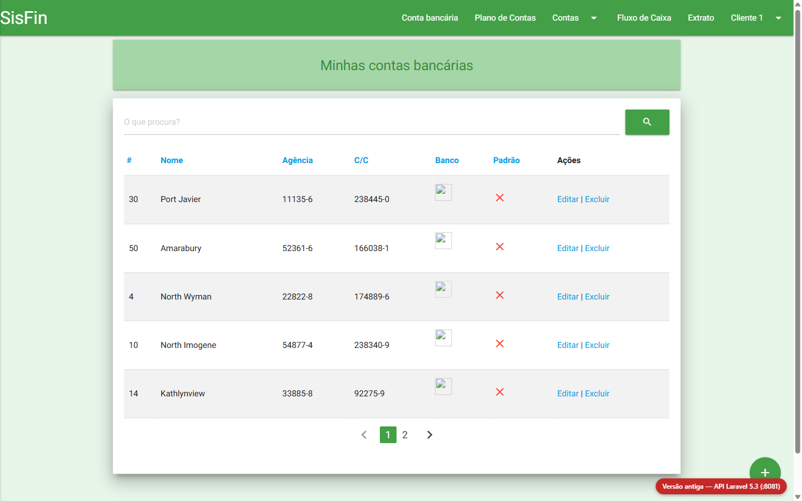
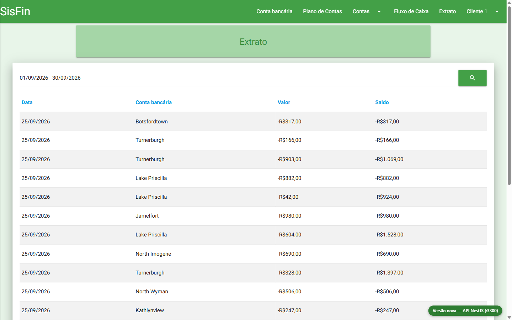

# sisfin-modernizacao

Case de **modernização de legado guiada por especificação (Spec-Driven Development) com agentes de IA**.

O sistema reescrito é o **SisFin**, sistema financeiro multi-tenant do meu TCC (2017): contas a pagar e receber,
contas bancárias, extrato, fluxo de caixa e assinaturas via Iugu, em Laravel 5.3 + Vue 1.
Ele é reescrito em NestJS + Vue 3, e cada regra de negócio precisa **provar** que foi preservada (ou mudada de propósito).

> Inspirado na [migração do app Shop da Shopify](https://shopify.engineering/shop-app-migration):
> o sistema antigo é o **oráculo**, os agentes documentam e implementam, e a paridade é verificada automaticamente.

## Como funciona

```text
legacy/ (oráculo, só leitura)
   │  engenharia reversa + sondas
   ▼
.specs/legado/   regras RN-* com arquivo:linha · dúvidas DUV-*
   │  decisão: manter | corrigir | descartar
   ▼
.specs/novo/     requirements (EARS) → design → tasks
   │  implementação por tasks
   ▼
api/ + web/      ◄── .specs/paridade/ (golden master capturado do legado)
```

| Pasta | O quê |
|---|---|
| `legacy/` | [Laravel-Vue.js](https://github.com/FranciscoWallison/Laravel-Vue.js) via `git subtree` — **nunca editado** |
| `.claude/` | Processo para o Claude Code: `CLAUDE.md`, comandos (`/mapear-modulo`, `/extrair-regras`, `/capturar-paridade`, `/spec-nova`) e subagentes (`arqueologo`, `security-reviewer`) |
| `.specs/legado/` | AS-IS: inventário, dados, comportamento, regras e dúvidas por módulo |
| `.specs/novo/` | TO-BE: requirements, design e tasks por módulo |
| `.specs/paridade/` | Casos golden master executados contra o legado |
| `.specs/decisoes/` | ADRs |
| `tools/rastreabilidade.mjs` | Matriz RN → REQ → Task → Paridade e detecção de órfãos |

## Rodando o oráculo

```bash
docker compose up -d --build     # PHP 7.1 + MySQL 5.7; migra e popula na primeira subida
curl -X POST http://localhost:8081/api/access_token \
  -H "Content-Type: application/json" \
  -d '{"email":"cliente1@user.com","password":"secret"}'
```

- App: http://localhost:8081 · MySQL: `localhost:33061` (`sisfin`/`sisfin`)
- Resetar os dados: `docker compose down -v && docker compose up -d` (seed determinístico, semente 42)

## As duas versões lado a lado

A **mesma tela** do sistema de 2017 (SPA Vue 1, compilado de `legacy/` — o bundle nunca tinha sido versionado),
servida duas vezes: só muda a API por trás. É o *Strangler Fig* visível.

| Endereço | O quê |
|---|---|
| http://localhost:8082/app#!/login | **Versão antiga** — tela → API Laravel 5.3 (:8081) · selo vermelho |
| http://localhost:8082/admin/login | Admin do **legado** (`admin@user.com` / `secret`) — o site Laravel sai pela mesma origem do app, como no deploy original |
| http://localhost:8083/login | Site **novo** — com `admin@user.com`, "Minha conta" → "Administração de bancos" |
| http://localhost:8083/app#!/login | **Versão nova** — mesma tela → API NestJS (:3300) · selo verde |
| http://localhost:3300/health | API nova |

Login: `cliente1@user.com` / `secret`. Na versão nova já funcionam **dashboard, contas a pagar/receber, contas bancárias,
plano de contas, extrato e fluxo de caixa** (com o gráfico do dashboard) — e, desde a etapa 19, também **criar, editar,
mover e excluir categorias e contas bancárias**. Desde a etapa 25, o admin de bancos também (entre como
`admin@user.com` / `secret` e abra http://localhost:8083/my-financial → "Administração de bancos"). As assinaturas também
saíram do legado (etapa 27): Stripe no lugar da Iugu, com um simulador local — o roteiro com o Stripe real está em
[docs/roteiro-stripe.md](docs/roteiro-stripe.md).
Os dados do banco novo vêm do legado: `node tools/migrar-dados.mjs`.

| Versão antiga | Versão nova |
|---|---|
|  |  |

## Harness

Guias e sensores que deixam os agentes trabalharem com segurança — hooks de pré/pós-edição, aprovação de plano
amarrada a hash, observabilidade de SQL do oráculo, CI. Mapa completo e análise de viabilidade em [`docs/harness.md`](docs/harness.md).

## Paridade (golden master)

```bash
node tools/paridade.mjs                                   # compara com o esperado (legado em :8081)
node tools/paridade.mjs --capturar RN-CON-009             # regrava o esperado de um caso a partir do legado
node tools/paridade.mjs --base http://localhost:3300 --alvo novo  # contra o sistema novo, com as divergências aprovadas
```

Os casos (`.specs/paridade/<modulo>/*.json`) só falam HTTP: criam os próprios dados, guardam variáveis
(`salvar`), projetam só os campos relevantes (`caminho` + `campos`) e verificam efeitos por **deltas**
(`derivar`), então rodam repetidamente e contra qualquer implementação.

## Progresso

| Módulo | AS-IS | Paridade | TO-BE | Implementado |
|---|---|---|---|---|
| contas | ✅ 19 regras, 9 dúvidas (todas respondidas), contrato | ✅ 8 casos + 4 regras n/a cobertas por tasks | ✅ requirements, design e tasks aprovados (hash `d854ed6545ef`) | ✅ **migrado** — paridade 9/9, espelho 15/15, 157 testes; revisado por segurança — ver [progresso](.specs/novo/contas/progresso.md) |
| auth | 🟡 3 regras (controles de segurança) | ✅ 1 caso | 🟡 no REQ-CON-13 / ADR-005 | ⚪ |
| fluxo-de-caixa | ✅ 8 regras, 5 dúvidas, contrato | ✅ 3 casos | ✅ aprovado (ADR-006) | ✅ **migrado** — paridade 3/3; tela e gráfico funcionando; DUV-FLX-005 pendente |
| categorias (escrita) | ✅ 11 regras, 7 dúvidas, contrato | ✅ 6 casos | ✅ aprovado (ADR-007, hash `baf1b8d63868`) | ✅ **migrado** — paridade 6/6; tela funcionando; revisado por segurança; DUV-CAT-004 e 007 pendentes — ver [progresso](.specs/novo/categorias/progresso.md) |
| contas-bancarias (escrita + bancos) | ✅ 9 regras, 5 dúvidas, contrato | ✅ 4 casos | ✅ aprovado (ADR-007, hash `547b3519e39d`) | ✅ **migrado** — paridade 4/4; espelho 20/20; telas de criar e editar funcionando — ver [progresso](.specs/novo/contas-bancarias/progresso.md) |
| extrato | ✅ 7 regras, 3 dúvidas, contrato | ✅ 2 casos | ✅ aprovado (ADR-008, hash `fa8f9227d732`) | ✅ **migrado** — paridade 2/2; tela abre no mês e ordena por Data e Conta (500 no legado) — ver [progresso](.specs/novo/extrato/progresso.md) |
| site (cadastro e login) | ✅ 9 regras, 6 dúvidas, contrato; 5 sondas reproduzíveis | n/a (HTML → API; ADR-009) + **E2E** no navegador (7) | ✅ aprovado (ADR-009, hash `af43e2de4789`) | ✅ **migrado** — cadastro/login/minha conta em Vue 3 (`web/`), na mesma origem do app; revisado por segurança — ver [progresso](.specs/novo/site/progresso.md) |
| admin de bancos | ✅ 7 regras, 7 dúvidas, contrato; 2 sondas reproduzíveis | n/a (HTML → API; ADR-010) + **E2E** no navegador (4) | ✅ aprovado (ADR-010, hash `bb0f9a303b2e`) | ✅ **migrado** — criar e editar funcionam pela 1ª vez (no legado, sempre 500), upload validado pelo conteúdo, logos num volume servido pela `:8083`; revisado por segurança — ver [progresso](.specs/novo/admin-bancos/progresso.md) |
| assinaturas (Iugu → Stripe) | ✅ 9 regras, 10 dúvidas, contrato; 1 sonda reproduzível | n/a (HTML + provedor externo; ADR-011) + **E2E** com o simulador (3) | ✅ aprovado (ADR-011, hash `542d2e109610`) | ✅ **migrado** com o simulador — Stripe Checkout e portal, webhook assinado, gate pronto (desligado); revisado por segurança; falta o roteiro com o Stripe real ([docs/roteiro-stripe.md](docs/roteiro-stripe.md)) — ver [progresso](.specs/novo/assinaturas/progresso.md) |

O passo a passo completo, com descobertas e lições, está no [diário de bordo](docs/diario-de-bordo.md).

### Achados até agora (pelas sondas no oráculo)

- **RN-CON-009** — mover uma conta paga para outra conta bancária não move o saldo.
- **RN-CON-010** — excluir uma conta paga não estorna o saldo e deixa extrato órfão.
- **RN-CON-006** — conta criada paga com repetição: todas as parcelas futuras nascem pagas e debitam o saldo hoje.
- **RN-CON-007** — o SQL observado mostra conta e extrato gravados fora da transação do saldo.
- **RN-CON-013** — conta sem categoria/conta bancária devolve 500 (erro de banco) em vez de 422.
- **RN-CON-015** — valor negativo é aceito; pagar uma conta a pagar negativa credita o saldo.
- **RN-CON-011** — dinheiro em `DOUBLE(8,2)`: ponto flutuante e teto escondido de 999.999,99.
- **RN-CON-012** — `->defalt(false)` numa migration: erro de digitação que o Laravel 5.3 aceitou em silêncio.
- **RN-CON-016** — sem busca, a lista de contas vem vazia: `""` vira `value = 0` — e isso depende da versão do ICU.
- **RN-CON-018** — os totais ignoram a busca por texto e erram a precedência `or … and done`.
- **RN-CON-019** — usuário sem cliente loga, mas a API inteira responde 500 (falha fechada, sem vazamento).
- **RN-CAT-003** — 🔴 outro cliente edita e move categorias alheias: a API responde 404, mas grava — e os valores da vítima aparecem no fluxo de caixa do atacante.
- **RN-CAT-009** — excluir uma raiz cuja filha tem contas dá 500, mas a raiz já foi apagada: as filhas ficam órfãs e somem da tela.
- **RN-CAT-011** — a árvore sai em ordem de id por acaso do plano do MySQL (sem `ORDER BY`); o espelho pegou o sistema novo ordenando por `_lft`.
- **RN-CBA-009** — a tela de edição de conta bancária reenvia o objeto inteiro do GET (inclusive `balance`); uma whitelist estrita quebraria a tela.
